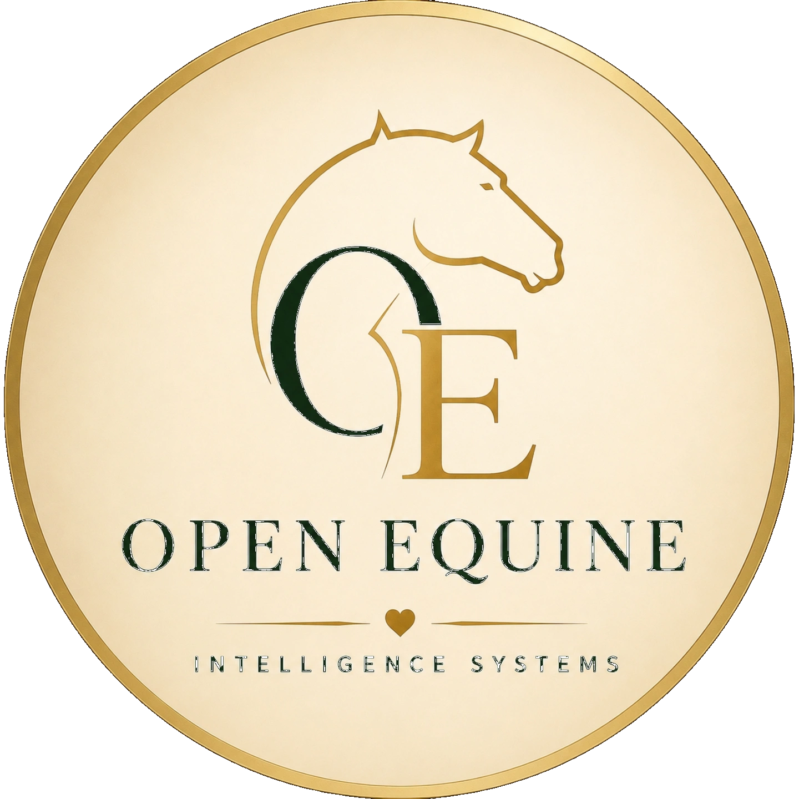

<p align="center">
  
</p>

<h1 align="center">Humanoid, Robotics & AI Safety Guidelines</h1>
<h3 align="center"> in Equine Industry</h3>
<h3 align="center">Open Equine Intelligence Systems — Horse AI</h3>
<h4 align="center">A TechXZone Pvt Ltd Initiative</h4>

<p align="center">
  <a href="https://www.gnu.org/licenses/agpl-3.0"></a>
  <a href="https://creativecommons.org/licenses/by-sa/4.0/"></a>
  
  
  
</p>


---

## About This Repository

This repository contains the guidelines framework developed by **Open Equine Intelligence Systems** for the deployment of humanoid machines, robotic systems, biomimetic devices, aerial systems, and AI tools in equine stable environments.

All documents in this repository are released under **CC-BY-SA 4.0**. All code and software components are released under **AGPLv3**. Both licences are free of cost and available for adoption, adaptation, and integration by any stable, equestrian organisation, veterinary authority, standards body, or technology manufacturer globally.

The definitions, classifications, and guidelines contained in this framework are developed in the context of equine stable environments. However, the underlying principles — relating to the sensory response characteristics of domestic animals, the risk profile of confined environments, and the behavioural response to biomimetic and autonomous machines — are applicable across domestic animal environments broadly. Organisations and institutions developing safety guidelines for other domestic animals, including bovine, ovine, canine, and other livestock or companion animal environments, are encouraged to reference and adapt this framework. Where adaptations are made, attribution to Open Equine Intelligence Systems is required under the terms of the CC-BY-SA 4.0 Licence.

---

## Why This Work Exists

Humanoid machines, autonomous robotic systems, and AI tools are being developed and deployed at scale. Manufacturers are targeting labour-intensive physical environments as primary commercial markets. Equine stable management is precisely that environment.

These machines are designed for general-purpose physical environments. Equine stable environments present a distinct set of deployment parameters — including the sensory response characteristics of horses, the spatial constraints of confined stable zones, and the response profile of horses to machines whose silhouette or movement resembles a living being — that are outside the scope of standard general-purpose deployment frameworks. This repository provides the equine-specific parameters that complement and extend those frameworks for stable environment deployment.

As of the date of this publication, no international standards body, equestrian federation, veterinary authority, or technology regulatory body has published guidelines governing the deployment of these machines in equine environments.

This repository addresses that gap.

---

## Repository Structure

```
humanoid-robotics-ai-guidelines/
│
├── README.md
├── LICENSE
│
├── Definition-of-Devices/
│   ├── OE-GL-000-DOD-Framework-v1.2.md
│   ├── Quality-Control/
│   │   └── Content-Quality/
│   │       └── OE-GL-000-DOD-ContentQuality-v0_12.xlsx
│   └── Rationale/
│       ├── OE-PRE-001_Industry-Rationale.md
│       └── OE-PRE-002_Inevitable-Arrival-Position-Paper.md
│
├── guidelines/
│   ├── OE-GL-001_Humanoid-Machines.md
│   ├── OE-GL-002_Biomimetic-Robotic-Systems.md
│   ├── OE-GL-003_Aerial-Systems.md
│   ├── OE-GL-004_Ground-Autonomous-Machines.md
│   ├── OE-GL-005_Wearable-Attached-Sensor-Systems.md
│   ├── OE-GL-006_Stationary-Intelligent-Systems.md
│   └── OE-GL-007_Algorithmic-Software-Systems.md
│
├── appendices/
│   ├── OE-APP-001_Acclimation-Protocol.md
│   ├── OE-APP-002_Supervision-State-Reference.md
│   ├── OE-APP-003_Proximity-Specifications.md
│   └── OE-APP-004_Override-Requirements.md
│
└── assets/
    └── logo.png
```

---

## Document Index

### Definition of Devices

| Reference | Title | Status |
|---|---|---|
| OE-GL-000 | Definition of Devices Framework — Intelligent and Biomimetic Systems in Equine Stable Environments | ✅ Published v1.2 |

### Rationale

| Reference | Title | Status |
|---|---|---|
| OE-PRE-001 | Industry Rationale — Why These Guidelines Are Needed | ✅ Published |
| OE-PRE-002 | The Inevitable Arrival — Humanoids and BRS in Equine Stables | ✅ Published |

### Quality Control

| Reference | Title | Status |
|---|---|---|
| OE-GL-000-DOD-ContentQuality | Content Quality Test Execution — 2 Runs, 0 Defects at Release | ✅ Published v0.12 |

### Guidelines

| Reference | Title | Status |
|---|---|---|
| OE-GL-001 | Safety Guidelines — Humanoid Machines | ✅ Published |
| OE-GL-002 | Safety Guidelines — Biomimetic Robotic Systems | 🔄 In Development |
| OE-GL-003 | Safety Guidelines — Aerial Systems | 🔄 In Development |
| OE-GL-004 | Safety Guidelines — Ground Autonomous Machines | 🔄 In Development |
| OE-GL-005 | Safety Guidelines — Wearable and Attached Sensor Systems | 🔄 In Development |
| OE-GL-006 | Safety Guidelines — Stationary Intelligent Systems | 🔄 In Development |
| OE-GL-007 | Safety Guidelines — Algorithmic and Software Systems | 🔄 In Development |

### Appendices

| Reference | Title | Status |
|---|---|---|
| OE-APP-001 | Acclimation Protocol Reference | 🔄 In Development |
| OE-APP-002 | Supervision State Reference | 🔄 In Development |
| OE-APP-003 | Proximity Specifications Reference | 🔄 In Development |
| OE-APP-004 | Override Requirements Specifications | 🔄 In Development |

---

## Where to Begin

### Researchers and Academic Institutions
1. Read `Definition-of-Devices/Rationale/OE-PRE-001` for documented risk context
2. Read `Definition-of-Devices/OE-GL-000-DOD-Framework-v1.2.md` for classification framework
3. Refer to relevant category document under `guidelines/`
4. Open a contribution request to participate

### Engineers, System Architects, and Technology Developers
1. Read `Definition-of-Devices/OE-GL-000-DOD-Framework-v1.2.md` to classify the system under development
2. Read the relevant category document under `guidelines/`
3. Refer to `appendices/` for proximity, supervision, and override specifications
4. Validate system design against all applicable documents before stable deployment

### Equine Institutions, Veterinary Professionals, and Welfare Organisations
1. Read `Definition-of-Devices/Rationale/OE-PRE-001` for equine-specific risk documentation
2. Read `Definition-of-Devices/OE-GL-000-DOD-Framework-v1.2.md` for technology category definitions
3. Refer to relevant category document for human oversight and veterinary authority specifications
4. Contribute equine welfare expertise via openequine.org

### Breeders, Stable Managers, and Equestrian Professionals
1. Read `Definition-of-Devices/Rationale/OE-PRE-002` for deployment context
2. Read `Definition-of-Devices/OE-GL-000-DOD-Framework-v1.2.md` to identify the technology category relevant to your facility
3. Refer to the relevant category document for permitted operations and supervision requirements
4. Refer to `appendices/` for acclimation protocols before any deployment

### Standards Bodies and Regulatory Authorities
1. Read `Definition-of-Devices/Rationale/OE-PRE-001` for the documented regulatory vacuum this framework addresses
2. Read `Definition-of-Devices/OE-GL-000-DOD-Framework-v1.2.md` for the classification and definitional structure
3. Refer to individual category documents for technical specifications and architectural requirements
4. Contact openequine.org for formal collaboration or integration into existing frameworks

---

## Quality Control

This framework publishes its quality control artifacts alongside every document release. Test cases, execution results, defect logs, and verification records are available in the `Quality-Control/` subfolder of each document folder.

The Definition of Devices document completed two-run quality verification prior to public release — zero defects at release. Quality control artifacts are released under CC-BY-SA 4.0 for external contributors to execute and submit results.

Contact [contact@openequine.org](mailto:contact@openequine.org) to submit test results or raise queries.

---

## Contributing

This framework is updated on a continuous basis as technology evolves, as new deployment scenarios emerge, and as community contributions are reviewed and incorporated.

Contributions are invited from equestrian professionals, veterinarians, system engineers, and researchers. Contributors whose input is incorporated into a published version will be named in that version's acknowledgements.

Contact [openequine.org](https://openequine.org) or email [contact@openequine.org](mailto:contact@openequine.org) to contribute.

---

## Review and Release Cycle

This framework is under active development.

**Phase 1 — Quarterly Review Cycle**
During the initial establishment phase, documents are reviewed and updated quarterly. Defects, errors, and contribution-based improvements are logged continuously and resolved within each quarterly release.

**Phase 2 — Six-Monthly Review Cycle**
As core documents stabilise and community adoption grows, the review cycle moves to six-monthly releases. Transition to this phase will be announced on openequine.org.

**Phase 3 — Annual Review Cycle**
Annual review cycles will be adopted once the framework is mature, widely adopted, and stable across all document categories. This phase is not anticipated in the near term. Transition will be announced on openequine.org.

**Defect and Contribution Tracking**
All defects, errors, and proposed contributions are logged continuously. The defect tracking location will be updated shortly on openequine.org.

Release dates are announced on openequine.org.

---

## Licence

| Component | Licence |
|---|---|
| Code and software | [AGPLv3](https://www.gnu.org/licenses/agpl-3.0) |
| Documents, guidelines, and test artifacts | [CC-BY-SA 4.0](https://creativecommons.org/licenses/by-sa/4.0/) |

You are free to use, copy, modify, adapt, and distribute this work for any purpose, subject to attribution to **Open Equine Intelligence Systems** and release of adaptations under the same licence.

See `LICENSE` for full terms.

---

## Governance

| | |
|---|---|
| **Issuing Body** | Open Equine Intelligence Systems — Horse AI |
| **Organisation** | A TechXZone Pvt Ltd Initiative |
| **Website** | openequine.org |
| **Contact** | contact@openequine.org |
| **Version** | 1.2 — May 2026 |
| **Code Licence** | AGPLv3 |
| **Document Licence** | CC-BY-SA 4.0 |

---

<p align="center">
  <strong>Open Equine Intelligence Systems — Horse AI</strong><br/>
  A TechXZone Pvt Ltd Initiative<br/>
  openequine.org &nbsp;|&nbsp; contact@openequine.org &nbsp;|&nbsp; May 2026<br/>
</p>
